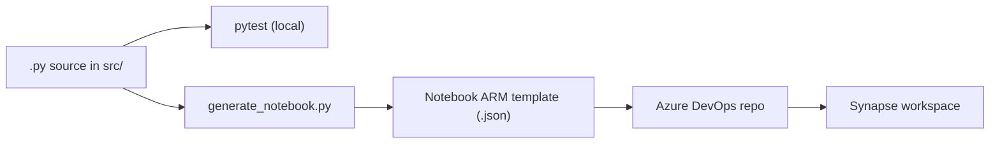

# synapse_sdk

Utilities to develop Azure Synapse Analytics notebooks the way you write regular Python: in your editor, with tests, in version control — and then ship them into a Synapse workspace via Azure DevOps.

## Why this exists

Synapse notebooks are great for running things and not so great for writing them. The browser editor has no linting, no real tests, no diffs, and no branches — so the moment a notebook grows past "kind of works" it becomes hard to maintain. Teams end up with code that lives in two places (a `.py` file someone uses locally + a notebook that mostly mirrors it) and drifts over time.

`synapse_sdk` collapses that gap: write and test plain Python in `src/`, then generate the Synapse notebook ARM template from the same source and commit it to the data product's Azure DevOps repo.

## Architecture



Three pieces:

1. **`src/generic_utils.py`** — the reusable Synapse helpers (table I/O, Delta operations, key vault access, ASQL, ML workspace, Kusto, storage account). Imported in your local `.py` files; rewritten to `%run generic_utils` when converted to a notebook.
2. **`src/generate_notebook.py`** — converts a `.py` file to a Synapse notebook ARM template (`.json`).
3. **`commit.sh`** — runs tests, generates the templates, and pushes them to the target data product's Azure DevOps repo.

## Project layout

```
src/                # library + conversion script
  generic_utils.py
  generate_notebook.py
  notebook_converter.py
  vacuum_notebook.py
tests/              # pytest suite
documentations/     # per-class reference docs
Makefile            # venv / build / lint / test / clean
setup.py            # packaging + pinned deps
commit.sh           # end-to-end build + push
```

## Install

```bash
make venv
source .venv/bin/activate
make build-all     # installs runtime + test extras
```

Requires Python >= 3.10. The `build` extra pulls in `pyspark` and `delta-spark`; the `test` extra pulls in `pytest`, `pytest-cov`, `pylint`, `flake8`.

## Usage

### Generate a notebook from a `.py` file

```bash
python3 src/generate_notebook.py src/generic_utils.py notebook
```

Positional args:

1. Path to the `.py` file to convert (default: `generic_utils.py`)
2. Output folder (default: `notebook`)

The result is `notebook/generic_utils.json` — a Synapse notebook ARM template whose cells mirror the source file. `import generic_utils` / `from generic_utils import ...` lines are rewritten to `%run generic_utils` magic so the notebook can pull in the shared helpers at runtime. The same rewrite happens for `test_helper`. `import mssparkutils` is dropped (Synapse provides it).

### End-to-end: build, test, push to Azure DevOps

`commit.sh` is the full workflow. Customize these variables at the top of the script:

- `FILES` — `.py` files to convert and commit
- `REPOSITORY_URL` — target Azure DevOps repo
- `BRANCH_NAME` — target branch (existing or new)
- `COMMIT_MESSAGE`

Then:

```bash
make commit
```

This wraps `commit.sh`, which: creates a venv, installs deps (`make build-all`), runs `make test` + `make lint` (commit aborts on failure), converts each `.py` to a notebook ARM template, clones the target repo, copies the JSON into its `notebook/` folder, commits, pushes, and cleans up. First push to a new repo prompts for credentials.

To roll the same notebook out to another data product, edit `TARGET_DATA_PRODUCT_NAME` in `new_deployment.sh` and run:

```bash
make deploy
```

Do not `source` the scripts directly — they use `set -e` and `exit`, which would terminate your interactive shell on any failure.

### Use the helpers in your own Synapse notebook

Write a regular `.py` file that imports from `generic_utils`, test it locally, then convert + commit:

```python
# my_pipeline.py
from generic_utils import DataProduct, Table

dp = DataProduct(name="sales", storage_account="myadls")
orders = Table(data_product=dp, name="orders")
orders.vacuum(retention_hours=168)
```

After `generate_notebook.py my_pipeline.py notebook`, the resulting notebook starts with a `%run generic_utils` cell, then runs the rest of your code.

## What's in `generic_utils`

| Class | Purpose |
|---|---|
| `Utils` | base helpers |
| `Notebook` | notebook-scoped configuration / parameters |
| `DataProduct` | a logical data product (storage + naming conventions) |
| `Table` | Delta table read/write/vacuum/optimize |
| `LHTSparkDataFrame` | DataFrame wrapper with project-specific conveniences |
| `KeyVault` | secret retrieval via `mssparkutils` |
| `AsqlDatabase` | Azure SQL access |
| `AzureMachineLearningWorkspace` | AML workspace handle |
| `Kusto` | Kusto/ADX queries |
| `SynStorageAccount` | storage account operations |

Per-class reference lives in `documentations/`.

## Make targets

| Target | What it does |
|---|---|
| `make venv` | create `.venv` |
| `make build` | install runtime deps (editable) |
| `make build-test` | also install test deps |
| `make build-all` | both of the above |
| `make lint` | pylint + flake8 |
| `make test` | pytest + coverage report |
| `make commit` | build, test, convert, push notebooks to the data product repo (wraps `commit.sh`) |
| `make deploy` | roll the generated notebook out to another data product (wraps `new_deployment.sh`) |
| `make clean` | remove `.venv`, caches, egg-info |

## Tests

`tests/` covers descriptors, the conversion script, and each helper class:

```bash
make test
# or
python -m pytest
```

CI runs the same local-safe flow (`make build-all`, lint, `make test`) on every push/PR to `main` via `.github/workflows/`.
Tests that create or inspect Delta tables and use Synapse notebook orchestration depend on the Synapse runtime (`mssparkutils`, workspace storage, and a real Spark session), so `tests/test_data_product.py`, `tests/test_dataframe.py`, `tests/test_table.py`, and `tests/test_generic_notebook.py` need to be tested within Synapse.

## Design decisions

- **ARM template generation, not Synapse REST API uploads.** The notebook JSON lives in the data product's repo alongside its pipelines and Spark job definitions, so the entire workspace is reproducible from git and deploys via the existing ARM pipeline. No out-of-band notebook state.
- **`%run generic_utils` instead of inlining the helpers.** Each data product imports the shared library at runtime, so a fix to `generic_utils` doesn't require rebuilding every dependent notebook.
- **Azure DevOps as the integration point.** Synapse workspaces in this stack are wired to Azure DevOps repos, not GitHub. `commit.sh` pushes there directly so the workspace's git integration picks the change up on its next sync.
- **Descriptor-based attribute validation (`PositiveNumber`, `StringValue`, …).** Catches bad config at construction time rather than mid-pipeline.

## Limitations

- **PySpark / Synapse runtime only.** The helpers depend on `mssparkutils`, `delta-spark`, and `pyspark`. Local execution of the helpers themselves is limited to what doesn't touch the Synapse runtime.
- **One `.py` → one notebook.** No multi-file packaging into a single notebook; the `%run` magic is the composition mechanism.
- **No notebook → `.py` reverse conversion.** Source-of-truth is the `.py` file.
- **Cell boundaries follow `%run` magic only.** Regular Python code becomes one cell per contiguous block between `%run` directives. No `# %%`-style cell markers.
- **Azure DevOps only.** `commit.sh` assumes Azure DevOps auth; using GitHub or another remote requires editing the script.
